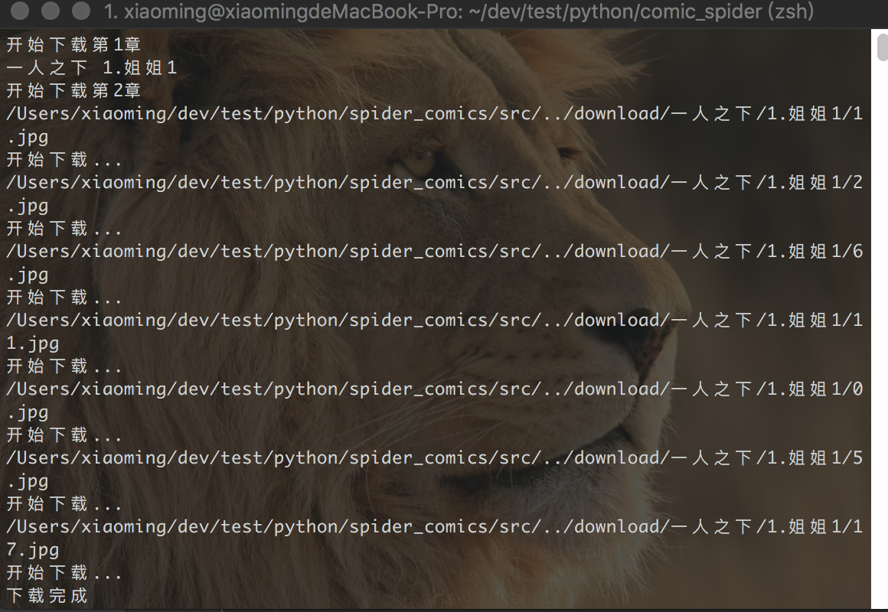
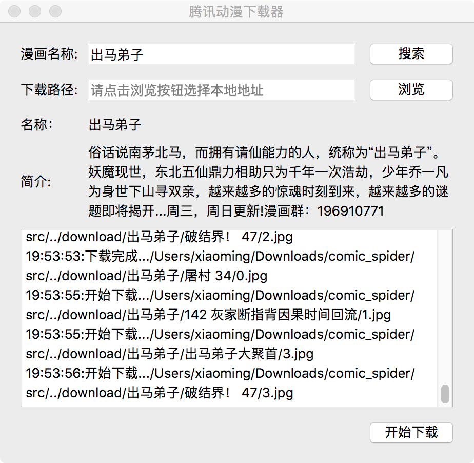

# Comic_Spider
<pre>
    简单的多进程爬取腾讯动漫demo
</pre>
## Usage
- 代码示例
```python
    SpiderComic().down_comic('一人之下')
```
- 命令行／shell
```bash
    python3 src/get_comics.py
```

- 界面运行--支持模糊查询
```bash
    python3 src/spider_ui.py
```


## ToDo
    多进程更新Qt界面